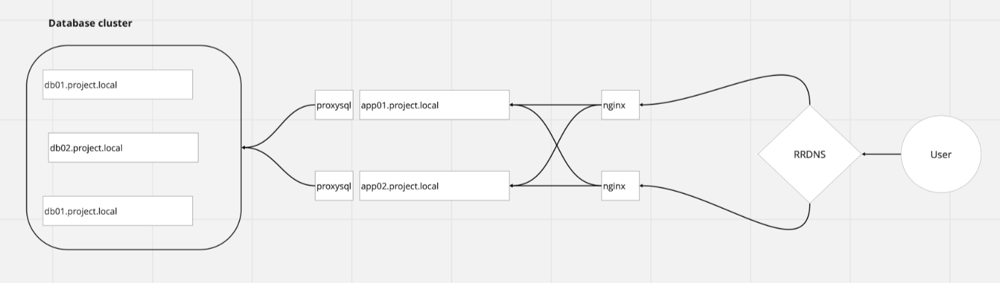

**Final team project group 1**

Инфраструктура состоит из:
- кластер mysql из трех нод 
- два сервера приложений
- сервер мониторинга

**Предварительные условия**

Операционная система виртуальных машин Ubuntu 20.04LTS  
Ресурсные емкости всех виртуальных машин 1vcpu, 2G vram, 30Gb диск.  
Система управления конфигурациями Ansible  
Версии БД - последние stable, совместимые с актуальной версией WordPress  

.
